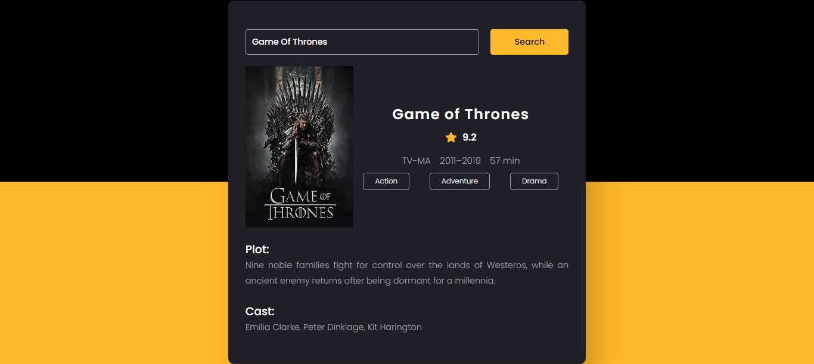

# Vihara Senindu Movie Guide App ⚡️
Introducing our innovative Movie Guide App, a dynamic tool crafted using HTML, CSS, and JavaScript technologies. Discover the latest movies effortlessly, making it ideal for film enthusiasts, cinephiles, and movie buffs.




## How To Use 

```bash

# Clone this repository
git clone https://github.com/vihara-senindu/movieguideapp

```
## Language & Technology Used 

- [HTML](https://en.wikipedia.org/wiki/HTML5)
- [CSS](https://en.wikipedia.org/wiki/CSS)
- [JAVASCRIPT](https://en.wikipedia.org/wiki/JavaScript)
- [Movie API](https://www.omdbapi.com/)

## Developer
- [Creator](https://github.com/Vihara-Senindu)
